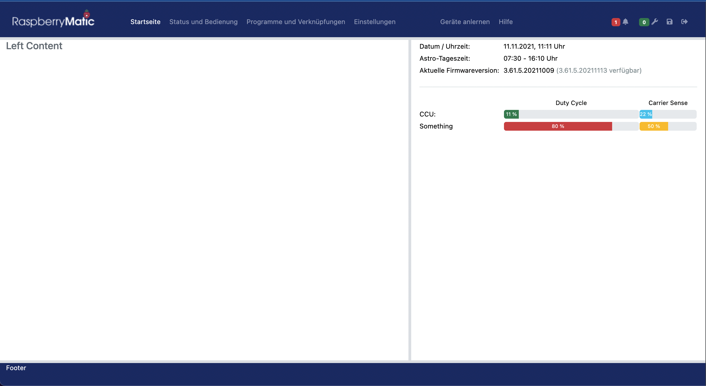

# RM-WebUI-Colors

**Trial & Error** for a new WebUI style of the RaspberryMatic project

# Development

Get bootstrap with npm:

    $ npm install

Setup `vscode` and install extensions:

- `Live Server` (recommended)
- `Live Sass Compiler` (recommended)
- `Bracket Pair Colorizer 2` (optional)
- `ìndent-rainbow` (optional)
- `Prettier - Code formatter` (optional)

Configure extensions in `settings.json`:

        "liveSassCompile.settings.formats": [
        // This is the default.
        {
            "format": "expanded",
            "extensionName": ".css",
            // null for all three -> denotes the same path as the SASS file
            "savePath": null,
            "savePathSegmentKeys": null,
            "savePathReplaceSegmentsWith": null
        },
        // You can add more
        {
            "format": "compressed",
            "extensionName": ".min.css",
            // / -> denotes relative to the workspace root
            "savePath": "./css"
        }
    ],